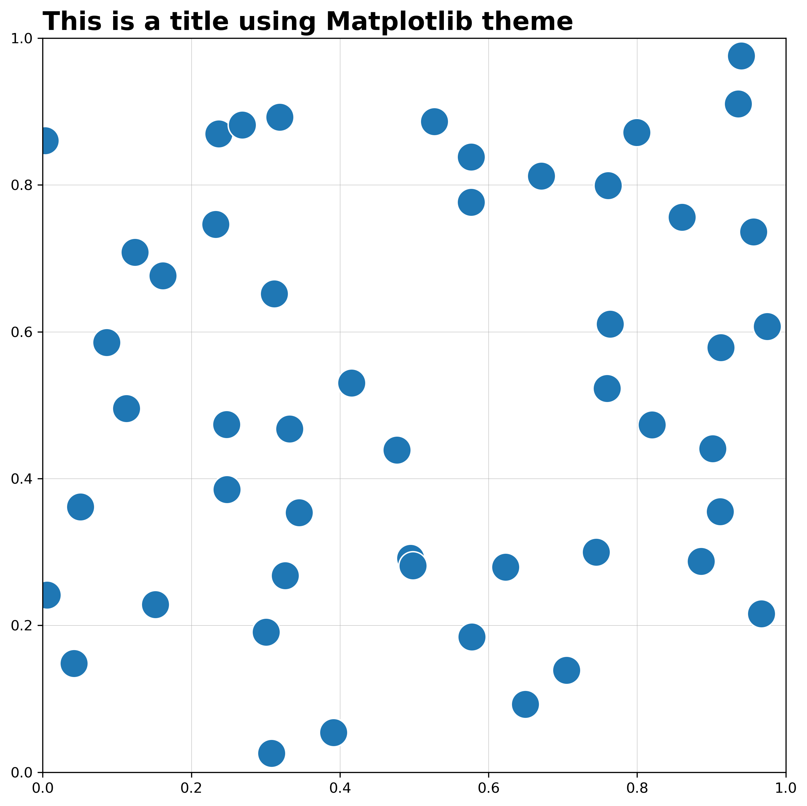

# ThemePy

An open source theme selector / creator and aesthetic manager for Matplotlib. This wrapper is intended to create an open-source community-driven theme library for matplotlib. The aim is to simplify the process of customising matplotlib plots and to enable users who are relatively new to python or matplotlib to move beyond the default plotting params we are given with matplotlib.

Taking a class-based approach, themes can now hold state. This makes it easier to keep track of colors and params that are usually set as variables, hardcoded, or added as args to matplotlib/pyplot functions. This allows us to reduce complexity of setting custom fonts etc... and gives us flexibility in moving between themes, not to mention the reduced typing by breaking down our interaction with matplotlib's rcParams into declarative functions.

# Contributing

Contributors are welcome to this pacakge. The key idea behind this is to simplify interaction with matplotlib and have usable themes and modifications through declarative language. To acheive this each function should look to do just one thing and params for each function should be relatively few.

All contributing is handled through PRs (Pull Requests). In order to contri bute users must:
1. Fork this repo and create branch from `master`
2. Clone the environment 
3. Make changes to code or additions to codebase / new themes
4. Test these to ensure that they function as expected
5. Commit code and create a pull request outlining changes made

### Contributing Themes
The main goal of this package is to have professional, well thought out themes available to all. If you would like to contribute a theme, look in the themes folder for a sample of how they should look. Including fonts in here is okay, but please only include fonts that are free and publicly available. If a font is included, please provide a url to the source in the PR. Similar to the above, to contribute themes:

1. Fork this repo and create branch from `master`
2. Clone the environment 
3. Add you theme .txt file to the themes folder
4. Test these to ensure that they function as expected
5. Commit code and create a pull request outlining your new theme, including its name. Do not commit images.


To get started after cloning, in the root of the repo, create a `notebooks` folder and inside create a new jupyter notebook. Add the following:

```
import sys
sys.path.append("..")
import themepy
```


# Examples

This is still in early development. A python version >= 3.7 is required (just clone the env). This package is not yet available on PyPi. We can get started straight away by instantiating a Theme class. We can do this without passing a specific theme, this will use matplotlib's defaults.

```
import matplotlib.pyplot as plt
import themepy

theme = themepy.Theme()
```

if we created a plot it would look like a regular matplotlib plot. 

```
# creating random data
np.random.seed(402)
x = np.random.uniform(0,1,50)
y = np.random.uniform(0,1,50)

# can adjust themes and params here
(theme
 .set_theme() # we could change to a different theme here. Passing no theme resets theme to default matplotlib
 .set_font() # we could set a new font here
 .set_pips() # we could set the tick marks on the x and y axis on or off here
 .set_spines() # we could show or hide the boarders of the plot here
 .set_ticklabel_size() # we could change the size of the x and y tick labels here
)


# create plot
fig, ax = plt.subplots(figsize=(8,8))
ax.set_title("This is a title using {} theme".format(theme.theme_name),
             loc="left", **theme.title_font, fontsize=18, fontweight="bold")


ax.grid(linewidth=.25, zorder=1)

ax.scatter(x,y,
           color=theme.primary_color, # the first colour in cycle, our primary color 
           edgecolors=theme.background, # our background colour (figure.facecolor)
           s=400,
           zorder=2)

ax.set_xlim(0,1)
ax.set_ylim(0,1)

plt.show()

```



However, we can now make some quick alterations to our plot

```

# creating random data
np.random.seed(402)
x = np.random.uniform(0,1,50)
y = np.random.uniform(0,1,50)

# adjusting font, pips, spines, and tick size here
(theme
 .set_font("Century Gothic")
 .set_pips(False)
 .set_spines("off", which=["top","right"])
 .set_ticklabel_size(12)
)


# create plot
fig, ax = plt.subplots(figsize=(8,8))
ax.set_title("This is a title using {} theme".format(theme.theme_name),
             loc="left", **theme.title_font, fontsize=18, fontweight="bold")


ax.grid(linewidth=.25, zorder=1)

ax.scatter(x,y,
           color=theme.primary_color, # the first colour in cycle, our primary color 
           edgecolors=theme.background, # our background colour (figure.facecolor)
           s=400,
           zorder=2)

ax.set_xlim(0,1)
ax.set_ylim(0,1)

plt.show()

```


`theme.title_font` and `theme.body_font` take the font passed either through the theme or through `theme.set_font`, but they can also be set individually.

There are two sample themes included. Dark version shown below:
```

# creating random data
np.random.seed(402)
x = np.random.uniform(0,1,50)
y = np.random.uniform(0,1,50)

# can adjust themes and params here
(theme
 .set_theme('sample-dark')
 .set_font("Century Gothic")
 .set_pips(False)
 .set_spines("off", which=["top","right"]) 
 .set_ticklabel_size(12)
)


# create plot
fig, ax = plt.subplots(figsize=(8,8))
ax.set_title("This is a title using {} theme".format(theme.theme_name),
             loc="left", **theme.title_font, fontsize=18, fontweight="bold")


ax.grid(linewidth=.25, zorder=1)

ax.scatter(x,y,
           color=theme.primary_color, # the first colour in cycle, our primary color 
           edgecolors=theme.background, # our background colour (figure.facecolor)
           s=400,
           zorder=2)

ax.set_xlim(0,1)
ax.set_ylim(0,1)

plt.show()

```


# Adding Themes

to do
# To Do:


- theme colors should be appended to the start of cycler instead of replacing
- add add_theme() function
- add remove_theme() function
- Docstring on Theme class
- Add Adding Themes section to readme
- Testing script
- Apply code formatting and guidelines for contributors